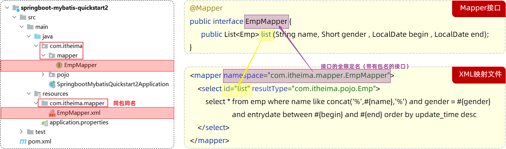
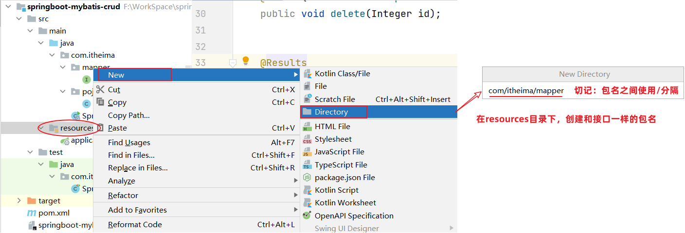
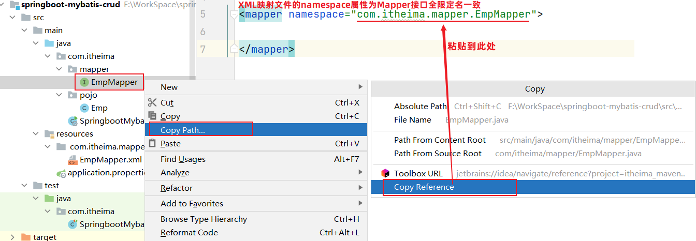
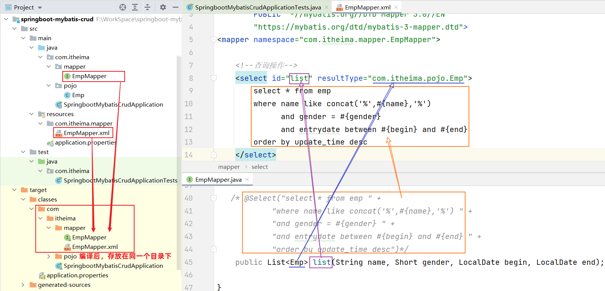
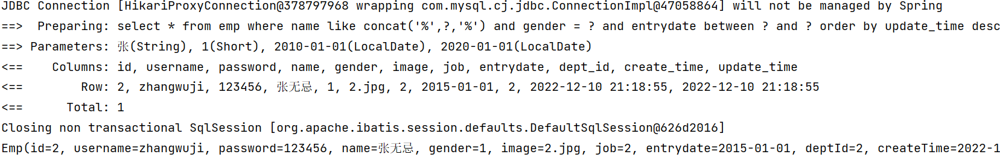
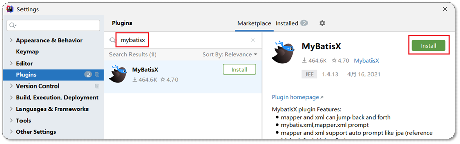
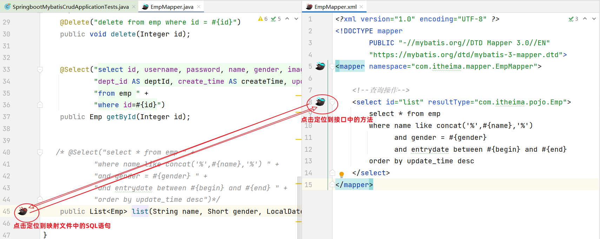
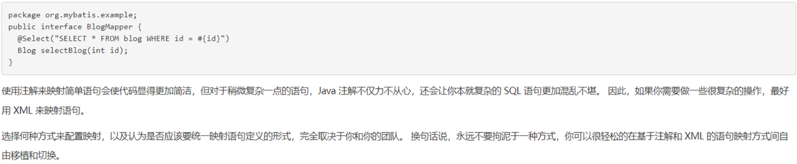

# 2. Mybatis的XML配置文件

前言

> 使用注解来映射简单语句会使代码显得更加简洁，但对于稍微复杂一点的语句，Java 注解不仅力不从心，还会让本就复杂的 SQL 语句更加混乱不堪。 因此，如果你需要做一些很复杂的操作，最好用 XML 来映射语句。
>
> 选择何种方式来配置映射，以及是否应该要统一映射语句定义的形式，完全取决于你和你的团队。 换句话说，永远不要拘泥于一种方式，你可以很轻松地在基于注解和 XML 的语句映射方式间自由移植和切换。

Mybatis的开发有两种方式：

1. 注解：用于简单的sql语句，不适用于复杂的
2. XML：复杂的sql更适用

## 2.1 XML配置文件规范

使用Mybatis的注解方式，主要是来完成一些简单的增删改查功能。如果需要实现复杂的SQL功能，建议使用XML来配置映射语句，也就是将SQL语句写在XML配置文件中。

在Mybatis中使用XML映射文件方式开发，需要符合一定的规范：

1. XML映射文件的名称与Mapper接口名称一致，并且将XML映射文件和Mapper接口放置在相同包下（**同包同名**）

2. XML映射文件的namespace属性为Mapper接口全限定名(**全类名**)一致

3. XML映射文件中sql语句的id与Mapper接口中的**方法名**一致，并保持**返回类型一致**。

> \<select>标签：就是用于编写select查询语句的。
>
> - resultType属性，指的是查询返回的单条记录所封装的类型。

## 2.2 XML配置文件实现

第1步：创建XML映射文件

> tip：包名间用/分隔  

第2步：编写XML映射文件

> xml映射文件中的dtd约束，直接从mybatis官网复制即可

~~~xml
<?xml version="1.0" encoding="UTF-8" ?>
<!DOCTYPE mapper
  PUBLIC "-//mybatis.org//DTD Mapper 3.0//EN"
  "https://mybatis.org/dtd/mybatis-3-mapper.dtd">
<mapper namespace="">
 
</mapper>
~~~

配置：XML映射文件的namespace属性为Mapper接口全限定名

~~~xml
<?xml version="1.0" encoding="UTF-8" ?>
<!DOCTYPE mapper
        PUBLIC "-//mybatis.org//DTD Mapper 3.0//EN"
        "https://mybatis.org/dtd/mybatis-3-mapper.dtd">
<mapper namespace="com.itheima.mapper.EmpMapper">

</mapper>
~~~

配置：XML映射文件中sql语句的id与Mapper接口中的方法名一致，并保持返回类型一致

~~~xml
<?xml version="1.0" encoding="UTF-8" ?>
<!DOCTYPE mapper
        PUBLIC "-//mybatis.org//DTD Mapper 3.0//EN"
        "https://mybatis.org/dtd/mybatis-3-mapper.dtd">
<mapper namespace="com.itheima.mapper.EmpMapper">

    <!--查询操作-->
    <select id="list" resultType="com.itheima.pojo.Emp">
        select * from emp
        where name like concat('%',#{name},'%')
              and gender = #{gender}
              and entrydate between #{begin} and #{end}
        order by update_time desc
    </select>
</mapper>
~~~

> 运行测试类，执行结果：
>
> 

## 2.3 MybatisX的使用

MybatisX是一款基于IDEA的快速开发Mybatis的插件，为效率而生。

MybatisX的安装：

可以通过MybatisX快速定位：

> MybatisX的使用在后续学习中会继续分享

学习了Mybatis中XML配置文件的开发方式了，大家可能会存在一个疑问：到底是使用注解方式开发还是使用XML方式开发？

> 官方说明：https://mybatis.net.cn/getting-started.html
>
>  

**结论：**使用Mybatis的注解，主要是来完成一些简单的增删改查功能。如果需要实现复杂的SQL功能，建议使用XML来配置映射语句。

